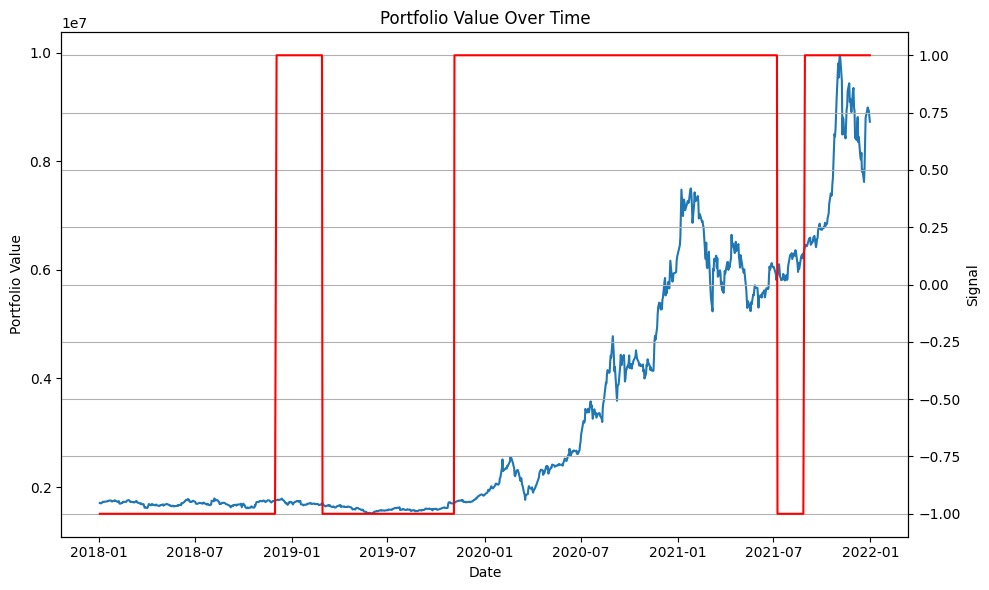

# Backtesting Engine for Trading Strategies and Performance Evaluation

 A simple trading backtesting engine for trading strategies in Python, allowing you to simulate trades based on historical market ata and evaluate the performance of trading strategies. It includes functionality for acquiring market data, implementing trading logic, executing trades, calculating performance metrics, and visualizing backtesting results. Provides a good starting point for anyone interested in backtesting trading strategies.

## Features

- **Acquire Market Data**: The framework uses the `yfinance` library to download historical market data for a given symbol and time period.
- **Build a Backtesting Engine**: The `BacktestingEngine` class serves as the core component of the framework. It initializes with market data, manages the portfolio, executes trades, and calculates performance metrics.
- **Implement Trading Logic**: Inside the `run_backtest` method of the `BacktestingEngine` class, you can implement your trading logic based on the available market data. The example provided uses a simple moving average crossover strategy.
- **Execute Trades**: The framework executes trades based on the trading signals generated by your trading logic. It updates the portfolio and keeps track of executed trades.
- **Calculate Performance Metrics**: The `calculate_performance` method of the `BacktestingEngine` class calculates performance metrics such as total profit and loss (P&L), average trade return, and win ratio based on the executed trades.
- **Visualize Results**: The `plot_portfolio_value` method of the `BacktestingEngine` class generates a plot showing the portfolio value over time and the buy/sell signals.
- **Evaluate Performance**: After running the backtest, the framework evaluates the performance of your trading strategy by calculating metrics such as total returns, annualized returns, volatility, and Sharpe ratio.
- **Test and Refine**: The framework provides a structure for testing and refining your trading strategies and framework.

## Example

Here's an example of how to use the trading backtesting framework:

```python
import pandas as pd
import numpy as np
import matplotlib.pyplot as plt
import ta
import yfinance as yf

# ... Implement preferred trading strategy parameters into the main functions ...

if __name__ == '__main__':
    main()
```

## Output Test: Portfolio Value Over Time, using $TSLA from 2000-01-01 to 2023-01-01




## Usage

1. Install the required dependencies by running `pip install -r requirements.txt`.
2. Import the necessary libraries and the `BacktestingEngine` class into your Python script.
3. Define your trading logic inside the `run_backtest` method of the `BacktestingEngine` class.
4. Call the `main` function to start the backtesting process.
5. Enter the ticker symbol for the security you'd like to explore when prompted.
6. Provide the start and end dates for the historical data in the format `YYYY-MM-DD`.
7. Evaluate the backtesting results, which include a portfolio value plot and performance metrics.

Feel free to modify and adapt the framework to suit your specific trading strategies and requirements.

## Requirements
The framework relies on the following libraries:
- pandas
- numpy
- matplotlib
- ta
- yfinance

You can install them using pip with the command `pip install -r requirements.txt`.

## Disclaimer
Please note that trading and investing in financial markets involves substantial risk. This framework is provided for educational and informational purposes only. It does not constitute financial advice or a recommendation to buy or sell any securities. Use the framework at your own risk and exercise caution when making trading decisions.


## Contributing
Contributions to this project are welcome. If you find any issues or would like to suggest improvements, please open an issue or submit a pull request.

Happy backtesting and trading!